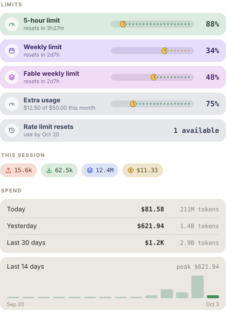

# claude-usage-mod

Your [Claude Code](https://claude.com/claude-code) usage as colored chips above the prompt: the 5-hour and weekly limits (% left), the Fable and extra-usage limits, the context window and today's spend. Open the Details pane for this session's tokens and cost, yesterday, the last 30 days and a 14-day chart.

<p align="center"></p>

<p align="center"></p>

<p align="center"><sub>Both drawn by the mod's own code with sample numbers, not screenshots. On the desktop app Pac-Man chomps and every chip has a tooltip.</sub></p>

## Install

```sh
claude plugin marketplace add kreddevils18/claude-usage-mod
claude plugin install usage-mod@claude-usage-mod
```

The same two steps work inside a session as `/plugin marketplace add kreddevils18/claude-usage-mod` and `/plugin install usage-mod@claude-usage-mod`. Then run `/reload-plugins`, or restart Claude Code.

## Use

| Command | What it does |
| --- | --- |
| `/usage-mod` | Opens the Details pane (the **Details** button on the band does the same) |
| `/usage-mod text` | Prints the same numbers as plain text, for surfaces that draw nothing |
| `/usage-mod refresh` | Re-reads your transcripts and the plan limits now, then prints the text |
| `/usage-mod debug` | Says whether the plan limits fetch worked and which fields it returned |

## What the band shows

| Chip | It means |
| --- | --- |
| **5h** / **7d** | The 5-hour and weekly plan limits: how much is left, and when each resets |
| **Fable** and other models | A model's own weekly limit, when your plan has one |
| **Extra** | Your extra-usage spend against its monthly cap, when extra usage is switched on and capped |
| **ctx** | The context window: how much is left before Claude Code compacts |
| **$81.58 today** | Spend today across all your sessions |

Hover a chip on the desktop app for a sentence saying what the number is.

**The bars are Pac-Man eating dots.** Pac-Man sits at how much you have used; the dots ahead of him are what is left. The dots are green with plenty left, yellow under 35% and red under 15%.

A chip that looks pale is a reading from an earlier session: a fresh session has no engine reading until its first response, so the mod shows the last one it saw rather than a blank band.

When the width is short the band fills up to two lines before it drops anything. If that is still too wide it gives up, in order: today's spend, the reset times, the context chip, and the bars (a window shrinks to its icon, name and percent). Every limit stays on the band until the very last step, where only the tightest one is left.

## The Details pane

`/usage-mod` or the **Details** button opens it:

- **Limits**: one row per window with the Pac-Man bar and the reset countdown. Fable and Extra always have a row, marked **No data** when your plan does not report them. When Anthropic has granted you one-off usage-limit resets, a **Usage resets** row shows how many are left and the deadline.
- **This session**: input tokens (↑), output tokens (↓), cache reads and writes (◈) and the session's cost so far.
- **Spend**: today, yesterday and the last 30 days, with a 14-day chart.

## Settings

In Claude Code's `/config` menu, under the plugin's name:

| Setting | Default |
| --- | --- |
| Band: `band` or `off` | `band` |
| Show today spend on the band | on |
| Plan limits from Anthropic (Fable, extra usage) | on |
| Tooltips and animation on the desktop app | on (turn it off if the band flickers) |
| Spend refresh minutes | 5 |

## Where it draws

| Where you run Claude Code | Band and pane |
| --- | --- |
| `claude` in a terminal | Yes, as colored text chips |
| The Code tab of the desktop app | Yes, as SVG pills with tooltips |
| The VS Code extension's chat panel, `claude -p` | No: use `/usage-mod text` |

## Requirements

- Claude Code **2.1.287 or later**, which is the first version with mods. Check with `claude --version`.
- [Node.js](https://nodejs.org) on your `PATH` for the **spend** figures (today, yesterday, 30 days, the chart). The script uses only Node's built-ins and was developed on Node 25. Without Node everything else still works, and the pane says the spend is missing.

## Where the numbers come from

| Figure | Source |
| --- | --- |
| 5h and 7d limits, context, session cost | Claude Code itself, as its status line gets them; the limits arrive with the first response of a session |
| Fable and other model limits, extra usage, rate limit resets | Anthropic's plan usage API, the one Claude Code's own `/usage` reads, asked through your signed-in session every few minutes. Model limits are the `weekly_scoped` entries of its `limits` list, extra usage is dollars spent over the monthly cap, resets are your granted one-off resets. It also fills 5h and 7d before the first response. Switch it off with the *Plan limits* setting |
| Session tokens | Added up from each completed turn; kept per session, so a resume continues the count |
| Today, yesterday, 30 days | `scripts/aggregate-usage.mjs` reads the usage numbers in your transcripts under `~/.claude/projects` and prices them with [`config/pricing.json`](config/pricing.json) |

**The dollar figures from transcripts are estimates at list price.** If you are on a subscription plan, they show what the same tokens would cost through the API, not what you are billed. Prices change; if a model is missing or wrong, the pane says so and [CONTRIBUTING](CONTRIBUTING.md#update-pricing) shows the one-line fix.

## What it does on your machine

It reads token counts and timestamps from your Claude Code transcripts and keeps a small summary in `~/.claude/claude-usage-mod`. It never keeps prompt text, tool output or file paths. Its one network request is the plan usage call above, made through Claude Code's credential handle, so the mod never sees your token; the setting turns it off. Details in [PRIVACY.md](PRIVACY.md).

A mod is code that runs inside Claude Code with your permissions, written by its publisher and not by Anthropic. Read the source before you install it; it is a few small files, and `claude plugin validate` lists every call it makes.

## Troubleshooting

- **Nothing shows above the prompt.** Run `/plugin` and look for `usage-mod`; run `/reload-plugins` or restart. Mods need Claude Code 2.1.287 or later, and the `view` setting must not be `off`.
- **The limits say "no reading yet".** They arrive with the first response of a session; send any message.
- **Spend is missing or old.** Check that `node` runs in a terminal, then run `/usage-mod refresh`. You can also run `node scripts/aggregate-usage.mjs` by hand or from cron: the mod reads the file it writes.
- **No Fable or Extra chip.** The pane's rows say **No data** when your plan does not report them: Extra needs extra usage switched on with a monthly cap. Run `/usage-mod debug` to see whether the plan call worked and which fields it returned. The endpoint is not a documented API, so it can change; when it fails the band falls back to the two windows Claude Code reports.
- **A figure disagrees with the plan page.** Limits and session cost come straight from Claude Code. The spend figures are the list-price estimate described above.

## Contributing

Pull requests are welcome, above all pricing updates. See [CONTRIBUTING.md](CONTRIBUTING.md).

## License

[MIT](LICENSE)
